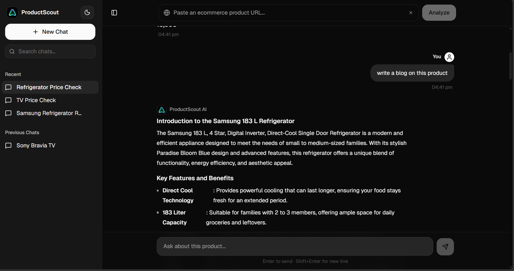

<p align="center">
  
</p>

#  ProductScout AI

**ProductScout AI** is a premium, high-performance e-commerce research assistant. It allows users to paste any product URL, instantly scrape its contents, and engage in a deep AI-powered conversation to analyze features, pricing, and reviews.

## Features

- **Real-time Web Scraping**: Instantly extracts product metadata, pricing, and specifications from major e-commerce platforms.
- **AI Analysis**: Powered by **LangChain** and **Groq**, providing lightning-fast, intelligent responses to any product-related query.
- **Modern Chat Interface**: A beautiful, ChatGPT-inspired UI featuring:
    - **Dynamic Sidebar**: Manage multiple conversations with ease.
    - **Theme Support**: Seamless transition between Light and Dark modes.
    - **Syntax Highlighting**: Perfectly formatted code and data blocks.
    - **Persistence**: Conversation history saved locally via **IndexedDB** (`idb-keyval`).
- **Premium Aesthetics**: Built with **Tailwind CSS v4**, **Shadcn UI**, and **Geist Variable** typography for a high-end feel.
- **Responsive Design**: Fully optimized for desktop and mobile experience.

## Tech Stack

### Frontend
- **Framework**: React 19 (Vite)
- **Styling**: Tailwind CSS v4, Shadcn UI
- **State Management**: Zustand
- **Data Fetching**: TanStack Query (React Query)
- **Markdown Rendering**: React Markdown + Rehype Highlight
- **Storage**: IndexedDB (via idb-keyval)
- **Icons**: Lucide React

### Backend
- **Framework**: FastAPI (Python)
- **AI Engine**: LangChain & LangChain-Groq
- **Scraping**: BeautifulSoup4 & HTTPX
- **Server**: Uvicorn

## Getting Started

### Prerequisites
- Node.js (v18+)
- Python 3.10+
- A Groq API Key

### Backend Setup
1. Navigate to the backend directory:
   ```bash
   cd backend
   ```
2. Create and activate a virtual environment:
   ```bash
   python -m venv venv
   # On Windows:
   venv\Scripts\activate
   # On macOS/Linux:
   source venv/bin/activate
   ```
3. Install dependencies:
   ```bash
   pip install -r requirements.txt
   ```
4. Create a `.env` file and add your Groq API Key:
   ```env
   GROQ_API_KEY=your_api_key_here
   ```
5. Start the server:
   ```bash
   uvicorn main:app --reload
   ```

### Frontend Setup
1. Navigate to the frontend directory:
   ```bash
   cd frontend
   ```
2. Install dependencies:
   ```bash
   npm install
   ```
3. Start the development server:
   ```bash
   npm run dev
   ```

## License

This project is licensed under the MIT License.